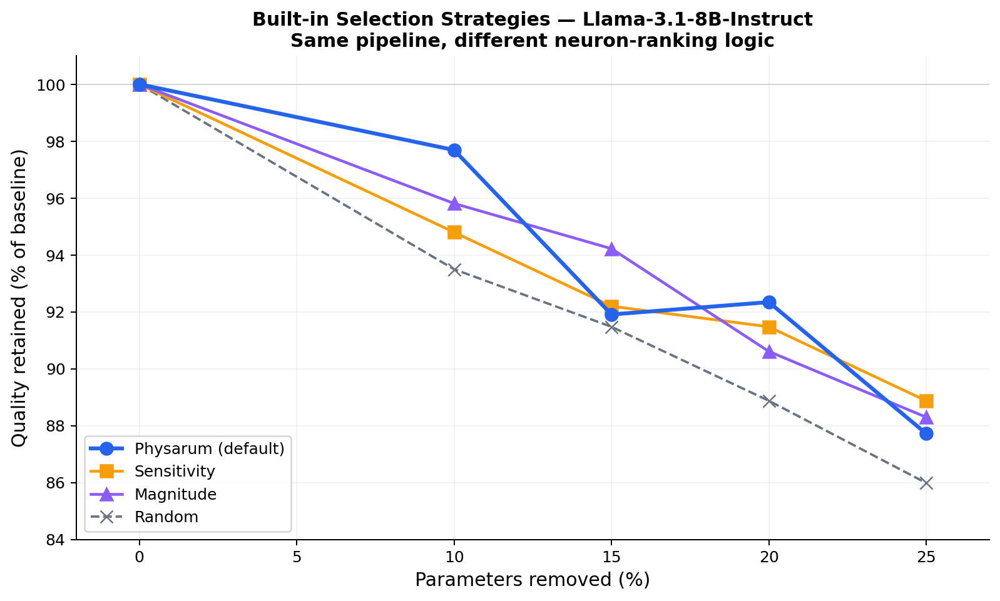
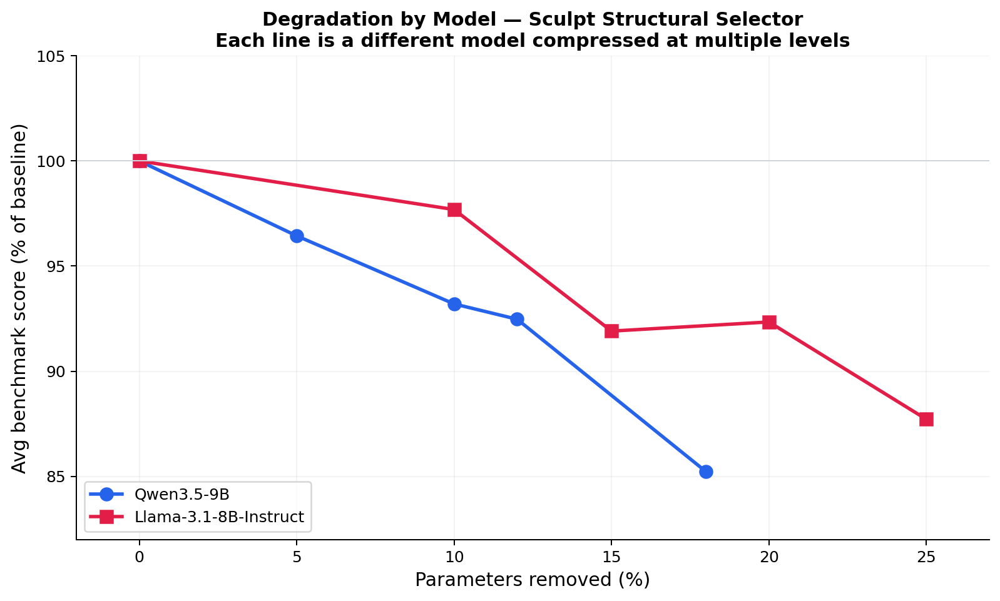

# Dystrio Sculpt

This project came from work I was doing on biologically inspired algorithms to balance inference across single and multi-GPU setups. The same principle — identifying coactivation of experts or ranks for GPU placement — can be applied to coactivation of neurons to understand how the model "thinks."

By recording which neurons coactivate when the model processes a specific workload, we can identify what's important for that type of work, and prune the rest. So Sculpt is a plug-and-play pruner that adapts to your workload — the model you get back is "sculpted" for your needs.

From our initial testing, the selection method performs well in the 9–20% reduction bracket. I'm sure there are better tweaks to the math to make it a consistent winner across all compression levels, which is why I'm opening this up — hoping to find some collaborators.

*The rest of this README is AI-generated from the codebase for usability. I'm not a technical writer, but I can trust the directions are correct because the same AI can run the commands and verify they work. The ideas and decisions are mine.*

---

**Mistral-7B at 89% the size, -0.2% average benchmark loss. Standard HuggingFace checkpoint.**

Sculpt finds and removes redundant neurons from LLM feed-forward layers. You get a
smaller, faster model that loads with `AutoModelForCausalLM.from_pretrained()` and
works with vLLM, llama.cpp, GGUF, Ollama — no custom runtime, no sparse kernels.

## Does it actually work?

### Selection strategies (Llama-3.1-8B-Instruct)

Sculpt's selector is pluggable — swap in any neuron-ranking strategy and the rest
of the pipeline (prescan, compress, repair, validate) stays the same. Here's how
four built-in strategies compare. Physarum ships as the default because it degrades
most gracefully, but you can bring your own:

<p align="center">
  
</p>

<details>
<summary>How does this compare to other pruning tools?</summary>

For reference, SliceGPT (ICLR 2024) reports 88% quality retention at 25% removal
on Llama-2-7B. Our structural selector retains 88% at the same level on
Llama-3.1-8B. These are different models, benchmark suites, and conditions — not
a controlled comparison. The key difference is output format: Sculpt produces
standard HuggingFace checkpoints that work with vLLM, GGUF, LoRA, and quantization
without any special runtime.
</details>

### Across model families

Different models compressed at multiple levels with the same pipeline.
Both degrade gracefully — the method generalizes across architectures:

<p align="center">
  
</p>

## Published models

Pre-sculpted checkpoints on [HuggingFace](https://huggingface.co/dystrio):

| Model | Type | Tier | Memory Reduction | Avg Benchmark Delta |
|-------|------|------|-----------------|-------------------|
| Mistral-7B-Instruct-v0.3 | Dense | Production | 11% | -0.2% |
| Mistral-7B-Instruct-v0.3 | Dense | Throughput | 18% | -1.4% |
| Llama-3.1-8B-Instruct | Dense | Production | 12% | -0.5% |
| Llama-3.2-3B-Instruct | Dense | Production | 10% | -0.3% |
| Qwen2.5-3B-Instruct | Dense | Production | 11% | -0.4% |
| gemma-2-2b-it | Dense | Production | 9% | -0.1% |
| OLMoE-1B-7B-0924 | MoE | Balanced | 9% | +0.04% |

All evaluated with [lm-eval](https://github.com/EleutherAI/lm-evaluation-harness)
on ARC-Challenge, HellaSwag, MMLU, and TruthfulQA. Full results in each model card.

## Quick start

```bash
pip install -e .

# One command — finds the best compression automatically
dystrio sculpt --model-id Qwen/Qwen2.5-3B-Instruct
```

Output is a standard HuggingFace checkpoint:

```python
from transformers import AutoModelForCausalLM, AutoTokenizer

model = AutoModelForCausalLM.from_pretrained("sculpt_out/frontier_0_production/model")
tokenizer = AutoTokenizer.from_pretrained("sculpt_out/frontier_0_production/model")
```

More examples:

```bash
# MoE model
dystrio sculpt --model-id allenai/OLMoE-1B-7B-0924

# Code-specialized workload
dystrio sculpt --model-id meta-llama/Llama-3.1-8B-Instruct --workload code_v1

# Emit 4 Pareto-optimal points
dystrio sculpt --model-id <model> --frontier 4

# Disable distillation (faster, lower quality)
dystrio sculpt --model-id <model> --no-distill
```

## How it works

1. **Prescan** — Measure operator sensitivity and inter-block coupling geometry
   across all FFN layers (or expert routing statistics for MoE)
2. **Risk scoring** — Compute structural risk per layer from sensitivity,
   coupling concentration, and spectrum rank
3. **Select** — Rank neurons/experts using a Physarum-inspired diversity penalty
   on top of operator-fidelity scores
4. **Compress** — Physically remove pruned neurons from weight matrices (dense)
   or drop + merge experts (MoE). Staged safest-first.
5. **Repair** — Knowledge distillation with cosine LR, regression tripwires,
   and best-checkpoint restore
6. **Validate** — Reload saved model, verify shapes and no NaN/Inf

For dense models, the output has a uniform reduced `intermediate_size` — a one-line
config change, no per-layer width vectors. For MoE, dropped experts are merged into
their most-coupled surviving neighbor before removal.

## Custom selectors

Step 3 (Select) is a pluggable function. The built-in options are `structural`
(Physarum, default), `sensitivity`, `magnitude`, and `random` — but you can
implement your own ranking logic. The interface is a single function that takes
block geometry and returns which blocks to keep:

```bash
# Use a built-in alternative
dystrio sculpt --model-id <model> --selector sensitivity

# See the implementations
ls src/dystrio_sculpt/selectors/
```

The rest of the pipeline (prescan, compress, repair, validate) works identically
regardless of which selector you use.

## Supported architectures

| Family | Models | Mode |
|--------|--------|------|
| Llama | Llama 2, Llama 3, Llama 3.1, Llama 3.2 | Dense |
| Mistral | Mistral 7B, Mistral Nemo | Dense |
| Qwen | Qwen2, Qwen2.5 | Dense |
| Gemma | Gemma 2 | Dense |
| Phi | Phi-3, Phi-3.5 | Dense |
| Mixtral | Mixtral-8x7B, Mixtral-8x22B | MoE |
| OLMoE | OLMoE-1B-7B | MoE |
| Starcoder | Starcoder2-15B | Dense |
| MiniCPM | MiniCPM-o | Dense |

Any decoder-only transformer with SwiGLU FFN blocks (`gate_proj`/`up_proj`/`down_proj`)
should work. Use `dystrio factory fingerprint --model-id <model>` to check.

## Workload-aware compression

This is the most important thing Sculpt does differently. The entire pipeline —
selection *and* repair — adapts to your data:

1. **Prescan**: neurons that never activate on your workload get flagged as redundant
2. **Selection**: the selector prunes what's dead weight *for your use case specifically*
3. **Repair/distillation**: the teacher-student training uses your data too, so it
   recovers the capabilities that matter to you rather than generic benchmarks

The result: if you feed it your customer-support logs, it keeps the neurons your
domain needs and repairs the model specifically for your distribution. A generically
pruned model treats all capabilities as equal — yours doesn't.

```bash
# Code-optimized: prunes neurons idle during code, repairs for code quality
dystrio sculpt --model-id meta-llama/Llama-3.1-8B-Instruct --workload code_v1

# General (default): preserves broad capability
dystrio sculpt --model-id meta-llama/Llama-3.1-8B-Instruct --workload general_v2

# Your own data: the full pipeline sees only what you care about
dystrio sculpt --model-id <model> \
  --workload none \
  --calib-dataset your-org/your-dataset \
  --calib-text-field text
```

| Preset | Focus | Sources |
|--------|-------|---------|
| `general_v2` | Balanced general capability | WikiText, MMLU, OpenHermes, HellaSwag, GSM8K, OpenOrca |
| `code_v1` | Code generation | CodeAlpaca, MBPP, HumanEval, WikiText, OpenHermes |

## Search behavior

Thompson Sampling finds the fastest model under a quality ceiling
(`--max-ppl-multiplier`, default 2.0x baseline PPL). The prescan risk score
adapts the search bracket automatically:

| Risk | Bracket | Strategy |
|------|---------|----------|
| Low (< 0.35) | 0.85 – 0.55 | Aggressive — model tolerates pruning |
| Medium | 0.88 – 0.62 | Standard sweep |
| High (> 0.65) | 0.92 – 0.72 | Conservative — tight coupling |

Skip search entirely with `--keep-fracs "0.90,0.85,0.75"`.

## The full stack: Sculpt → Fine-Tune → Quantize → Deploy

Because the output is a standard checkpoint with physically smaller matrices,
every downstream tool works on it. No adapters, no custom inference code.

```
 1. SCULPT           2. FINE-TUNE        3. QUANTIZE      4. DEPLOY
 dystrio sculpt      LoRA / QLoRA        GPTQ / AWQ       vLLM
 --workload code     (PEFT, Unsloth)     GGUF Q4_K_M      llama.cpp / Ollama

 7B → 5.6B           Cheaper: smaller    5.6B → ~1.5GB    Standard model
 (20% smaller)       base = less VRAM    (GGUF Q4)        on any stack
```

A sculpted + LoRA + quantized model can be 5–6x smaller than the original and
perform better on your task than the full-size base model.

## vs. other pruning methods

Qualitative comparison of approach differences (we haven't run all methods on
identical hardware — take as directional):

| | Sculpt | Unstructured (Wanda, SparseGPT) | LLM-Pruner |
|---|---|---|---|
| Output format | Standard HF checkpoint | Same-size model with zeros | Standard HF checkpoint |
| Speedup without sparse runtime | Yes | No | Yes |
| LoRA fine-tune after | Works | Sparse matrices break LoRA | Works |
| Stack with quantization | Yes (orthogonal) | Zeros conflict with quantization | Yes |
| Workload-adaptive | Yes | No | No |
| GGUF / llama.cpp / Ollama | Yes | No | Yes |
| Setup | One command | One command | Multi-step |

## Running locally

| Model Size | Min GPU VRAM | Example GPU | Approx Time |
|------------|-------------|-------------|-------------|
| 1–3B | 8 GB | RTX 3070/4070 | 15–30 min |
| 3–8B | 16–24 GB | RTX 3090/4090 | 30–90 min |
| 7–14B | 40–48 GB | A6000 / A100 | 1–3 hours |
| 70B+ | 80 GB+ | H100 / multi-GPU | 4–8 hours |

## Benchmarking

```bash
dystrio bench \
  --models org/baseline org/sculpted-production \
  --workloads wikitext chat rag code \
  --prompts-dir prompts/ \
  --outdir bench_out

dystrio bench-report --results-dir bench_out/results --outdir bench_out/report
dystrio bench-audit --bench-out bench_out
```

## CLI reference

```
Global flags:
  --quiet / -q      Minimal output
  --verbose / -v    Full debug output

dystrio sculpt [OPTIONS]
  --model-id TEXT                 HuggingFace model ID [required]
  --outdir TEXT                   Output directory [default: sculpt_out]
  --frontier INTEGER              Points to emit [default: 1]
  --max-ppl-multiplier FLOAT      Quality ceiling [default: 2.0]
  --keep-fracs TEXT               Skip search, evaluate these (comma-separated)
  --workload TEXT                 Workload preset [default: general_v2]
  --distill / --no-distill        Knowledge distillation [default: on]
  --target-prefill-speedup FLOAT  Min prefill speedup
  --max-compile-hours FLOAT       Time budget in hours
  --downstream-threshold FLOAT    Min downstream accuracy to accept
  --deterministic                 Bitwise-reproducible builds

  Calibration overrides:
  --calib-dataset TEXT            HF dataset [default: wikitext]
  --calib-config TEXT             Dataset config [default: wikitext-2-raw-v1]
  --calib-split TEXT              Dataset split [default: train]
  --calib-text-field TEXT         Text column [default: text]
  --calib-num-samples INTEGER     Max calibration samples
  --calib-seq-len INTEGER         Sequence length
  --calib-seed INTEGER            Sampling seed [default: 0]

dystrio bench [OPTIONS]
  --models TEXT ...               Models to benchmark [required]
  --workloads TEXT ...            Workloads [default: wikitext chat rag code]
  --prompts-dir TEXT              JSONL prompt packs directory
  --outdir TEXT                   Output [default: bench_out]
  --dtype TEXT                    bf16|fp16|fp32 [default: bf16]
  --device TEXT                   cuda|cpu [default: cuda]

dystrio bench-report --results-dir TEXT --outdir TEXT
dystrio bench-audit --bench-out TEXT
dystrio factory fingerprint --model-id TEXT
dystrio factory run [OPTIONS]
```

## Deterministic builds

```bash
dystrio sculpt --model-id <model> --deterministic
```

Seeds all RNGs (Python, NumPy, PyTorch, CUDA), disables TF32 and non-deterministic
cuDNN algorithms, uses isolated random state in the structural selector.

## Requirements

- Python >= 3.10
- PyTorch >= 2.1
- CUDA GPU (8–24 GB for small models; 40 GB+ more comfortable for 7B with distillation)

```bash
pip install -e ".[dev]"
pytest tests/
```

## Contributing

See [CONTRIBUTING.md](CONTRIBUTING.md).

## License

[Apache 2.0](LICENSE)
